# Help Desk Homelab

A practical Windows help desk portfolio project documenting virtual machine setup, Windows Server preparation, Windows client setup, and ticket-style troubleshooting workflows.

This project is designed for remote help desk, IT support, and technical support roles. It shows that I can follow a structured lab process, document my work clearly, organize screenshots, and explain beginner Windows support tasks in a professional way.

## Why This Project Matters

Hiring managers do not need a giant advanced cloud project to evaluate entry-level support ability. They need evidence that I can:

- Follow instructions and document my process
- Set up a basic technical lab
- Use PowerShell and Windows tools
- Prepare Windows Server and Windows client environments
- Capture clean troubleshooting evidence
- Write clear ticket-style documentation
- Explain what I did and why it matters

## Lab Environment

Planned lab setup:

- Host machine: Windows PC
- Virtualization: Oracle VirtualBox
- Server VM: `RYANLAB-DC01`
- Server OS: Windows Server 2022 Evaluation
- Client VM: Windows 11
- Future domain: `ryanlab.local`

## Tools Used

- Oracle VirtualBox
- Windows Server 2022 Evaluation ISO
- Windows 11 ISO
- PowerShell
- Git
- GitHub
- Markdown
- ShareX screenshots

## Current Status

Phase 0 and early VM setup are in progress.

Completed so far:

- Created project folder structure
- Installed and verified VirtualBox
- Downloaded Windows Server ISO
- Downloaded Windows 11 ISO
- Started creating the Windows Server VM
- Began organizing screenshots for GitHub documentation

## Screenshots

### 1. Project Folder Structure

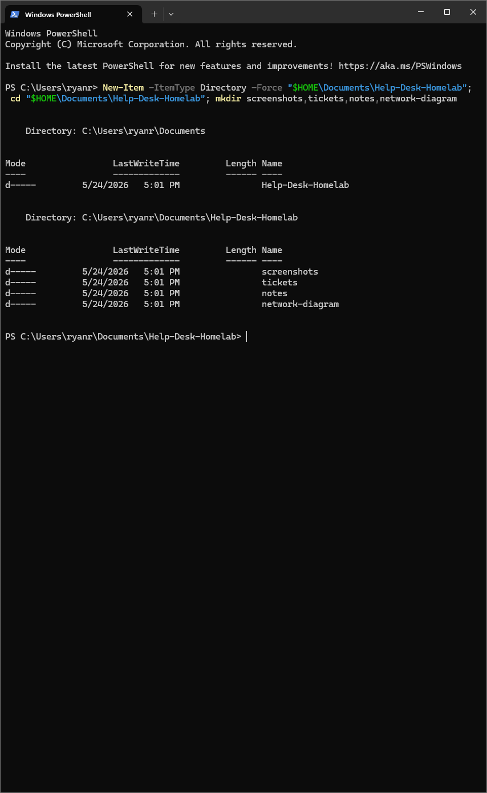

Created a clean local project structure for screenshots, tickets, notes, diagrams, and portfolio documentation.

### 2. VirtualBox Installed

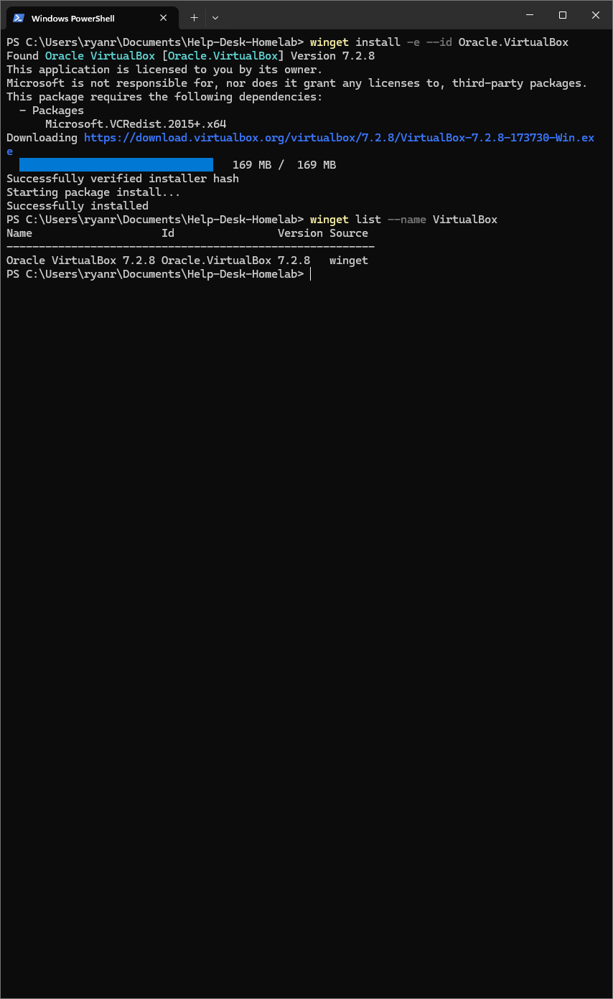

Installed and verified Oracle VirtualBox using PowerShell and winget.

### 3. Windows Server ISO Downloaded

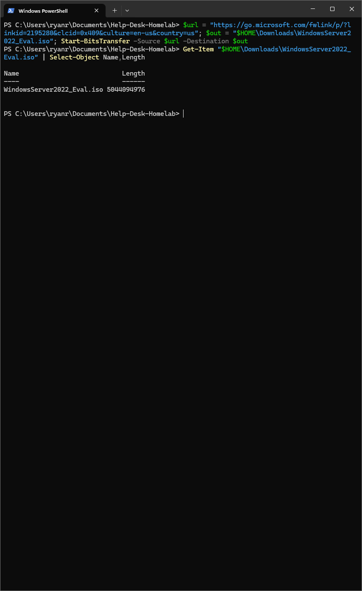

Verified the Windows Server 2022 Evaluation ISO was downloaded successfully.

### 4. Windows 11 ISO Download Started

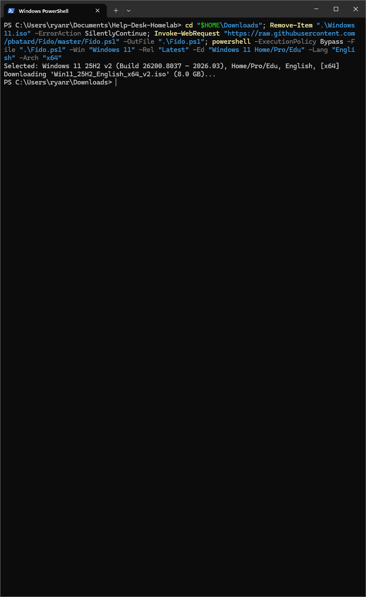

Started the Windows 11 ISO download using the PowerShell/Fido method.

### 5. Windows 11 ISO Downloaded

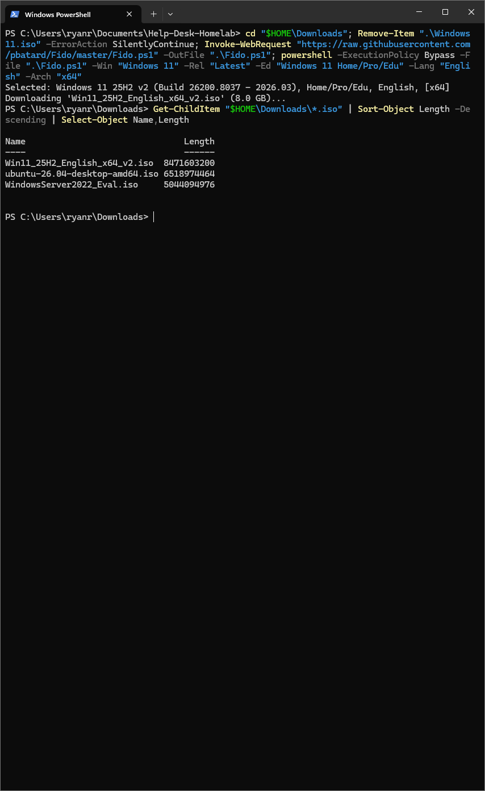

Verified the Windows 11 ISO downloaded successfully and is ready for the client VM.

### 6. Windows Server VM ISO Setup

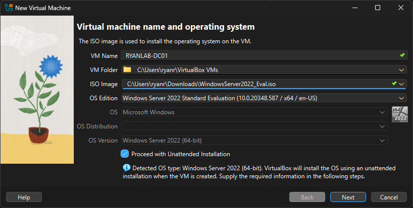

Created the `RYANLAB-DC01` virtual machine profile and attached the Windows Server 2022 ISO.

### 7. Windows Server VM Hardware Setup


Assigned memory, CPU, and virtual disk resources for the Windows Server VM.


### 8. Windows Server VM Created

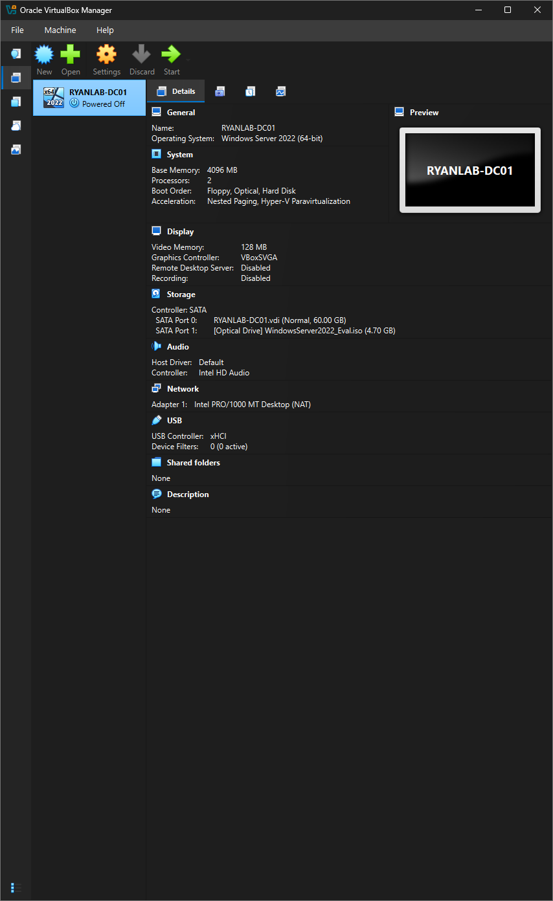

Confirmed the `RYANLAB-DC01` Windows Server virtual machine was created in VirtualBox with the expected memory, CPU, disk, and ISO settings.


### 9. Windows Server Setup Start

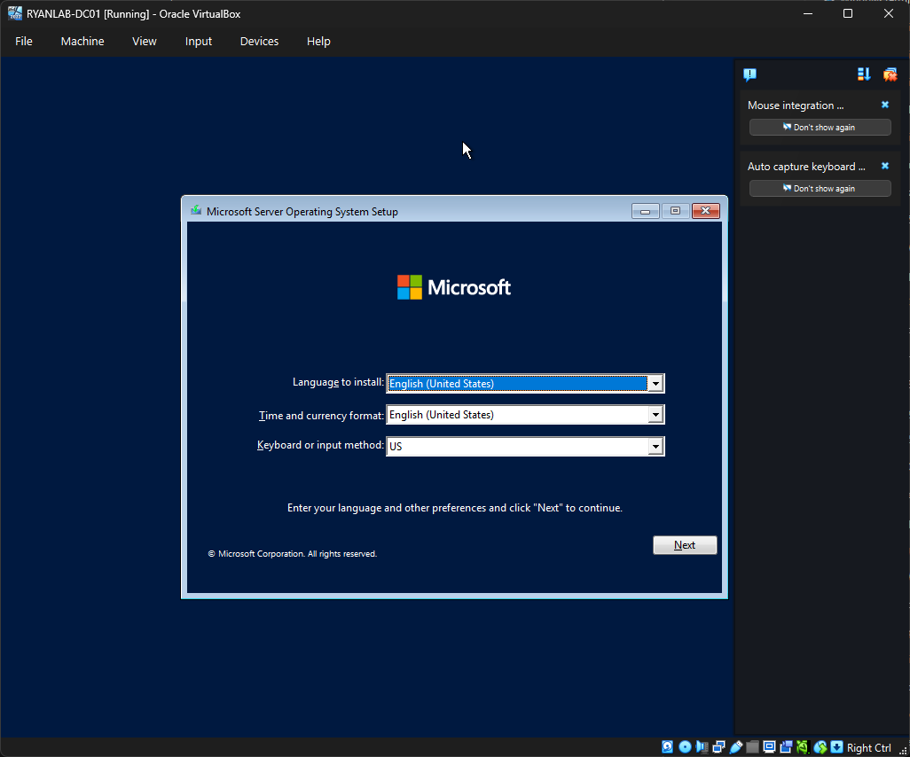

Started the Windows Server installation inside the `RYANLAB-DC01` VirtualBox VM.

### 10. Windows Server Edition Selection

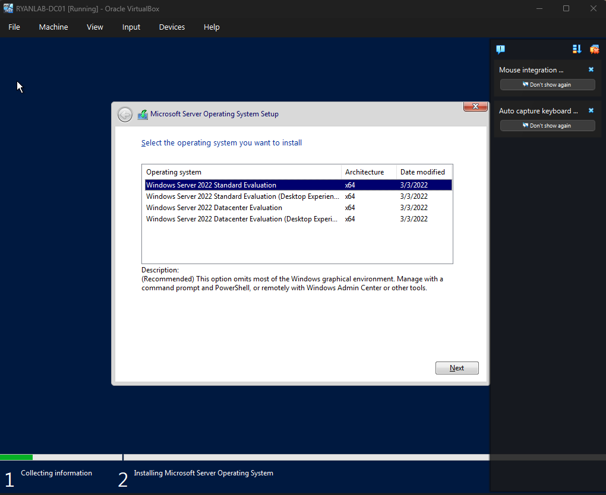

Selected Windows Server 2022 Standard Evaluation with Desktop Experience for a GUI-based help desk lab.

### 11. Windows Server Custom Install Type

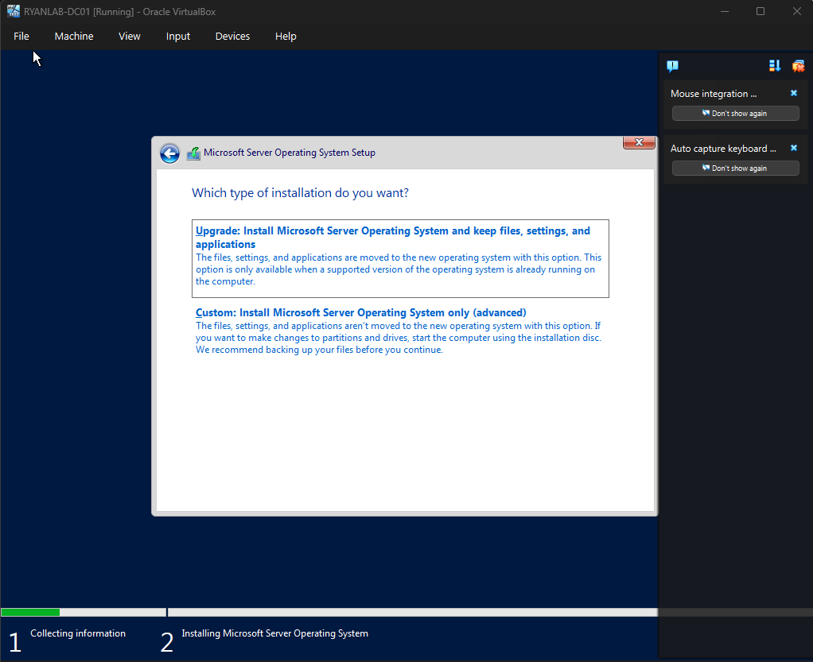

Chose a custom installation for a clean Windows Server install on the virtual machine.

### 12. Windows Server Drive Selection

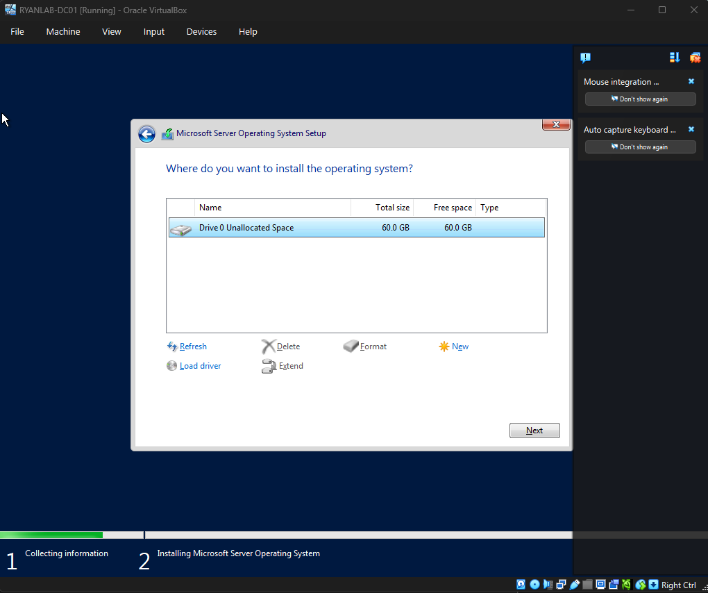

Selected the 60 GB unallocated virtual disk as the Windows Server installation target.

### 13. Windows Server Login Screen

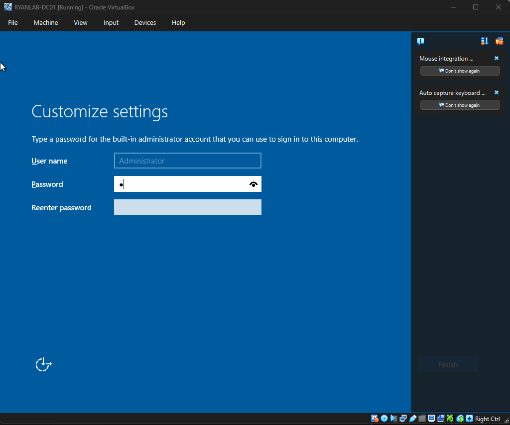

Confirmed Windows Server installed successfully and reached the login screen for the `RYANLAB-DC01` virtual machine.

## Screenshot Workflow

Screenshots are taken with ShareX and imported with a PowerShell script at the end of each session.

```powershell
# Copy screenshots from the last 2 hours into screenshots/inbox
.\scripts\import-latest-screenshots.ps1

# Or extend the window for a longer session
.\scripts\import-latest-screenshots.ps1 -Hours 4
```

After importing: review inbox, rename files to match the numbered sequence, move them to `screenshots/setup` or `screenshots/vm-setup`, then update the captions in this README. See [screenshot-manifest.md](screenshot-manifest.md) for the full workflow.

## Planned Help Desk Scenarios

This project will eventually include ticket writeups for:

- User cannot log in — password reset workflow
- Disabled account — account re-enable workflow
- New employee setup — create user and assign group access
- Shared folder access denied — permissions/group troubleshooting
- Client cannot reach domain — basic network/DNS troubleshooting
- Slow Windows computer — basic support triage

## Portfolio Value

This project is intentionally beginner-friendly and honest. It does not claim senior-level administration experience. It demonstrates practical support habits: lab setup, documentation, screenshots, troubleshooting notes, and structured communication.

## Next Steps

- Finish creating the Windows Server VM
- Install Windows Server
- Rename the server to `RYANLAB-DC01`
- Install Active Directory Domain Services
- Create test users and groups
- Create ticket-style documentation for each support scenario


